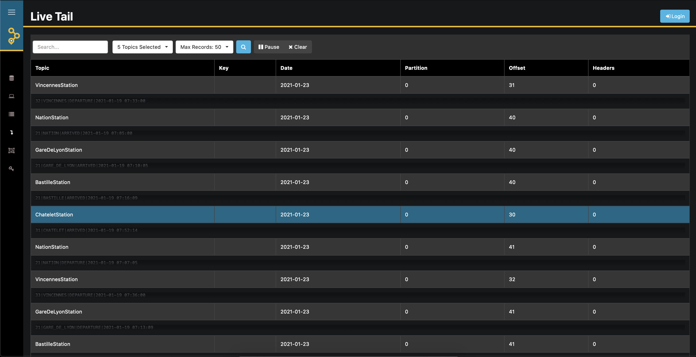
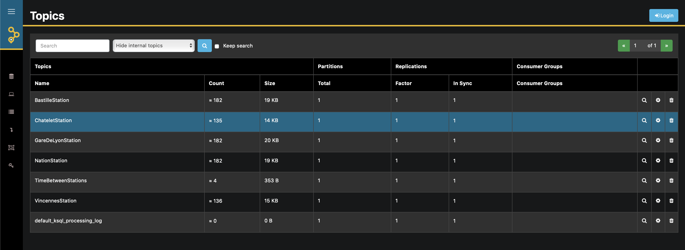
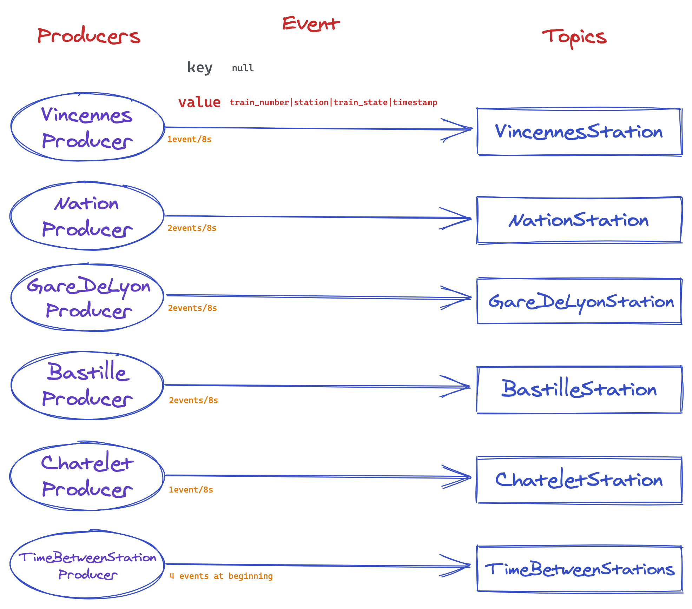
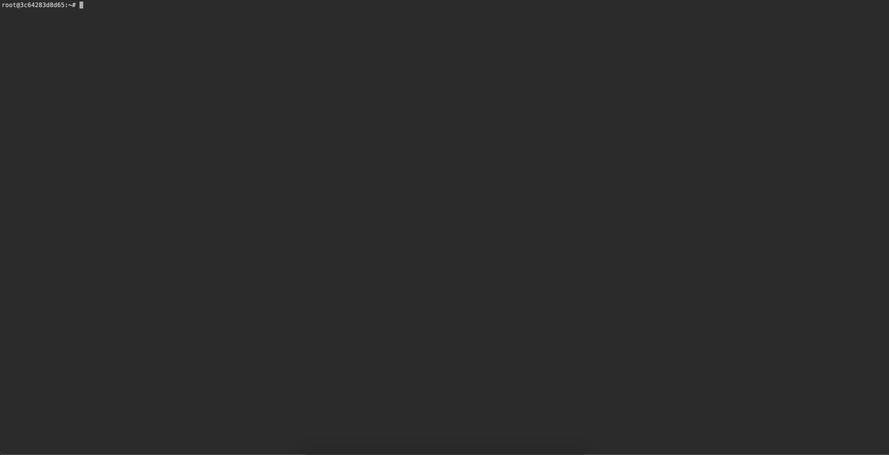
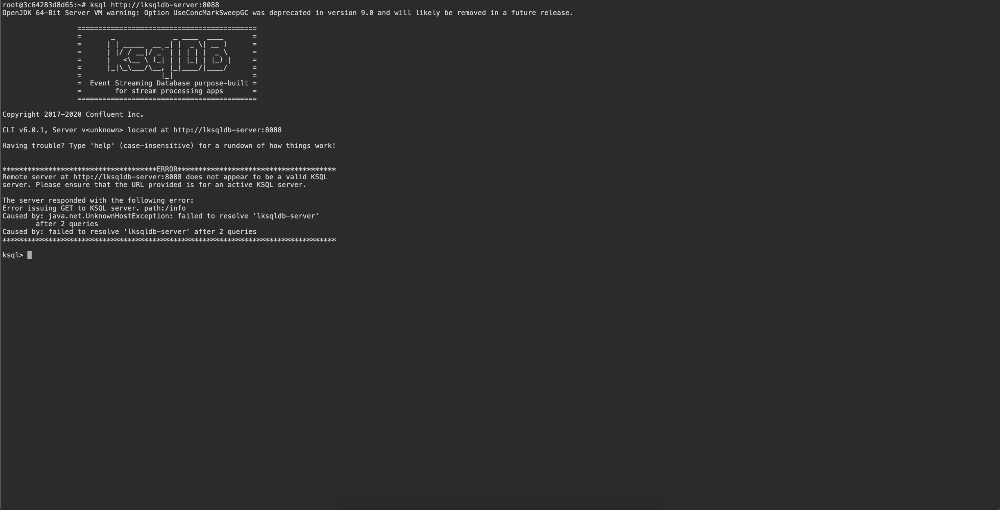

# Lab Kafka for classes at esme sudria

This docker stack run the necessary environment to perform kafka labs
on courses given at ESME Sudria.

This environment hosts these components :

* a kafka cluster with actives producers and real time feed topics about metro ligne 1 logs

* an administration for kafka with [AKHQ](https://github.com/tchiotludo/akhq)



## TLDR

This lab provides a kafka environment to play with ksqldb, a stream processing tool inspired by SQL.

Administrator interface can be seen at `http://localhost:8080`

Queries can be run on `http://localhost:7681` after entered `ksql http://ksqldb-server:8088`

To know more, please read the following.

## Step 1 : install the environment

1. clone this repository :

```
git clone https://github.com/Esme-Sudria-Database/lab-kafka.git
```

2. go on directory

```bash
cd lab-kafka
```

3. mount the lab

```bash
docker-compose up
```

4. Wait until download is finished and only logs from lab services appear on the terminal

## Step 2 : explore kafka topics

The administration console is accessible through your internet browser.

```bash
http://localhost:8080
```

Expand burger menu and click to `Topics`.

Browse and explore topic contents, topic metadata.



Don't hesitate to click on topics to see events ! 

### Details

There are currently 5 topics:
* VincennesStation
* NationStation
* GareDeLyonStation
* Bastilletation
* ChateletStation

The first five are filled continuously with logs from metro stations.

The sixth is filled once at initialisation.



### Station Producers

Station producers emits data continuously, at 1 event every 8 seconds for terminus and 1 event every 4 seconds for normal stations.

An event is a message composed by a **key**, `null` in our usecase, and a **value** of format `train_number|station|train_state|timestamp`.


## Step 3 : explore ksqldb

The ksqldb console is accessible through your internet browser.

```
http://localhost:7681
```
to launch terminal through your internet browser




Then copy/paste this command into the terminal to start ksqldb command line tool
```bash
ksql http://ksqldb-server:8088
```



At this point, you are able to run query from the course.


## Contributors

* Luc Marchand
* Fabien Arcellier
